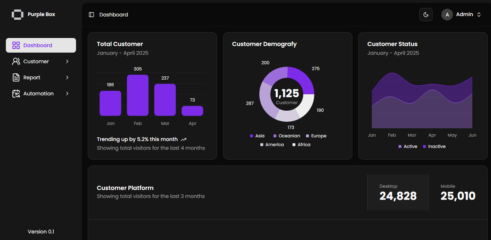

# 📝 Blog CMS - Full Documentation

A simple content management system (CMS) for blog posts built with **Next.js 15 App Router**, **TypeScript**, and **TailwindCSS**. This application allows admin users to create, read, update, and delete (CRUD) blog posts, while public users can view them. Authentication is handled via JWT and cookies. The app includes an API documentation page using Swagger.

---

## [💻 Live page](https://crm-purple-box-next.vercel.app)

### For Authentication

Email: <admin@example.com>
Password: admin123

---

## 📚 Features

- 📊 Dashboard with statistics using **Recharts**
- 👥 Customer list with filtering and search and pagination
- 📄 Placeholder pages: **Reports** and **Automation**
- 🔐 JWT authentication and route protection via **middleware**
- 📁 API endpoints for customers (mocked)
- ✅ Fully responsive (desktop & mobile)

---

## 🛠 Tech Stack

| Category       | Technology            |
| -------------- | --------------------- |
| Framework      | React.js (Next.js 15) |
| Styling        | Tailwind CSS          |
| Data Fetching  | SWR                   |
| Charts         | Recharts              |
| Mock Data      | Faker.js              |
| State/Router   | App Router (Next.js)  |
| Authentication | JWT (with Middleware) |
| Deployment     | Vercel                |

---

## 📦 Installation Guide

### 1. Clone the Repository

```bash
git clone https://github.com/HadiatAbdulBashit/simple-crm-next.git
cd simple-crm-next
```

### 2. Install Dependencies

```bash
npm install

# Or

bun add
```

### 3. Set Environment Variables

Create a `.env` file and set the following:

```env
JWT_SECRET="secret"
ADMIN_EMAIL="admin@example.com"
ADMIN_PASSWORD="examplepassword"
```

### 4. Start the Development Server

```bash
npm run dev

# Or

bun dev
```

---

## 🔐 Authentication Flow

- On login, JWT is generated and stored in cookies.
- Middleware checks for JWT in cookies on `/admin` and `/login` routes.
- Unauthorized access redirects to `/login`.
- Authorized user redirects to `/admin` when access `/login`.

---

## 🖼 Screenshoot


